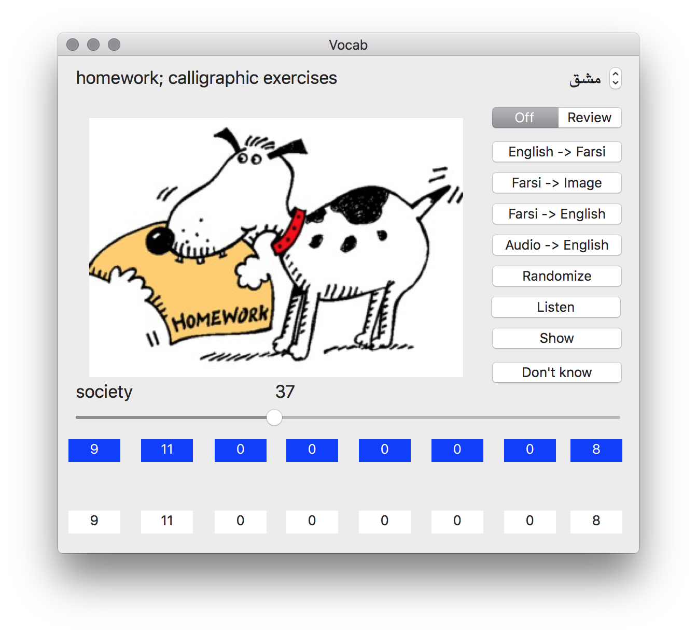

# vocab
Mac based application for language learning using images, audio and space repetition

Embedded in code is ability to use Forvo to download and locally save mp3 files for playback. This is to show proof of concept as such usage may be against Forvo's user agreement.

In addition you'll need the jpgs for all of the words. I've used Google Image previously to download images and store locally.

Given the above audio and images, there is a database here that can be used as a method of testing your language ability
When coupled with audio and images it provides a powerful way to improved your vocabulary.

This app was initially setup to be able to download images and audio, although with local files, networking capability is not needed.
For the current database, the image directory is about 240 Mbytes, which is why it is not checked in. If you want to try this out I can make that available to you, please contact me.

Also to use this with Forvo, you'll need to embed your FORVO API KEY, please see ForvoLayer.m for where to embed it ${FORVO_KEY}, then also comment out code in MasterViewController to enable 

